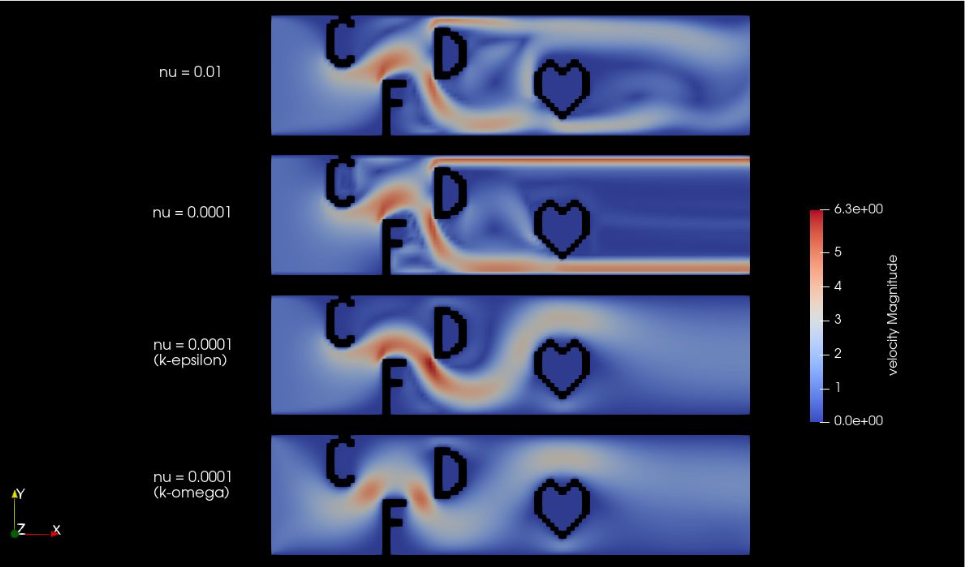

### Introduction

Vortigen is a CFD solver that supports turbulent flow on the GPU with various optimizations, preconditioners and more. The project itself is born from the TUM CFD Lab course. 
Vortigen supports CPU, CUDA and Vulkan solvers and supports K-epsilon, K-omega and SST K-omega turbulence models. It also supports MPI in the CPU solver.



## Software Requirements

* VTK 7 or higher
* MPI
* GCC 9 (optional)
* Vulkan 1.1 (optional)
* CUDA (optional)

### Running
The code has been tested on both Linux and Windows. For Linux you can build the code via CMake.
Make sure you enable CUDA or Vulkan support from the CMake settings.
```
Vulkan : cmake .. -DUSE\_VULKAN=ON
CUDA : cmake .. -DUSE\_CUDA=ON
```
Otherwise simply run with
```
mkdir build
cd build
cmake ..
make
```
Make sure you delete you CMake cache if you change these settings midway through the build. 
Also note that the Vulkan code is only tested and designed on a RTX 3060 GPU, therefore there may be problems with Vulkan on AMD hardware.

In order to run **Vortigen**, the case file should be given as input parameter. Some default case files are located in the `example_cases` directory. If you installed **Vortigen**, you can execute them from anywhere you want as  
* For Serial

```shell
vortigen /path/to/case/case_name.dat [-log]
```
* For MPI
```
mpirun -np <num_processes> ./vortigen /path/to/case/case_name.dat [-log] 
```

This will run the case file and create the output folder `/path/to/case/case_name_Output` which holds the `.vtk` files of the solution. If the `-log` flag is specified a log file will also be created in the output directory. The output folder is created in the same location as your case file. Note that this may require write permissions in the given directory.

If input file does not contain a geometry file, vortigen will run lid-driven cavity case with given parameters.

### Scene configuration
In addition to the usual options from the previous exercises, we have other options. All properties relevant for the simulation can be set in a .dat file.  
For reference see [this template](docs/TEMPLATE.dat)

* model
  ```
  0 -> Turbulence(default)
  1 -> K-epsilon model
  2 -> K-omega model
  3 -> K-omega SST model  
  ```
* solver
  ```
  0 -> SOR(default)
  1 -> PCG
  ```
* simulation
  ```
  0 -> CPU(default)
  1 -> Cuda
  2 -> Vulkan
  ```
* preconditioner
  ```
  -1 -> off(default)
   0 -> AINV
   1 -> SSOR
   2 -> Jacobi preconditioner
   ```
* refine
  ```
  <num> -> Scene is subdivided into 2^num cells
   ```   
Note that following combinations are not supported:
  * PCG - MPI
  * Cuda - MPI
  * Vulkan - MPI

### Design of boundaries and cell types

There are 5 different types of cells:

* FLUID
* OUTLET
* INLET
* NOSLIP_WALL
* FREESLIP_WALL

Cell types and geometry can be set via .pgm files, where the following values correspond to respective cell types.

| Values    | Cell Type     |
| --------- |:-------------:|
| 0         | FLUID         |
| 1         | OUTLET        |
| 2 - 9     | INLET         |
| 10 - 19   | NOSLIP_WALL   |
| 20 - 25   | FREESLIP_WALL |


### Single vs Double Precision

By default, we use double precision floating point numbers. If you want to switch to single precision, use the macro 
```C++
   #define USE_FLOATS 1
```
in `include/Utilities.hpp`


### More information

For more information about Vortigen, refer to  `docs/CFDLabDocument.pdf`

### License

This project is licensed under MIT license.
