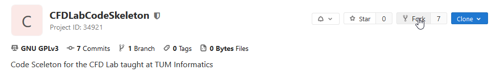
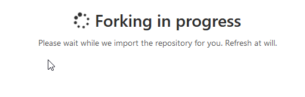
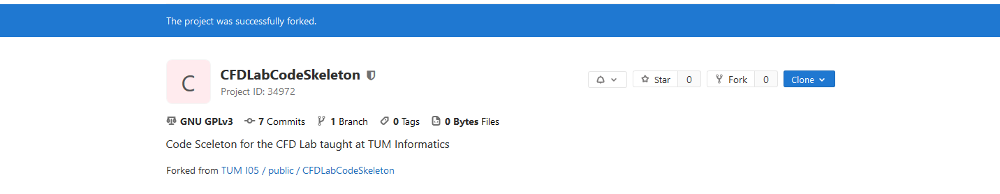
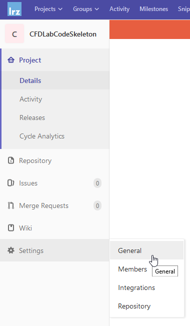
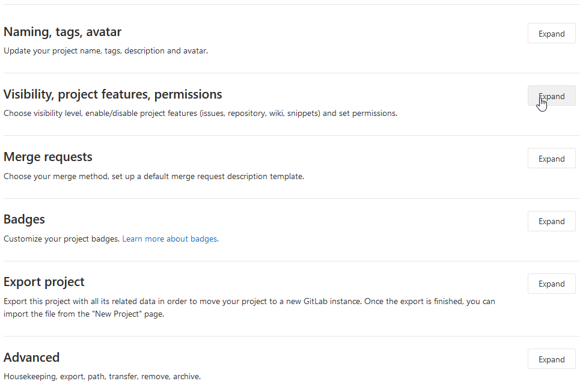
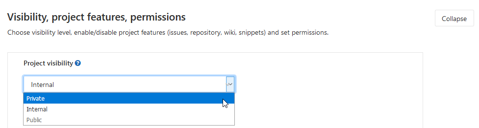
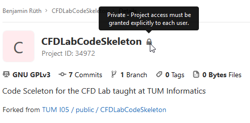
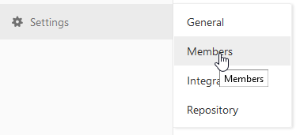
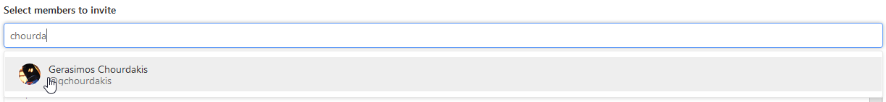

# Summary

For your development we ask you to use Git (a version control system) and the GitLab instance hosted by LRZ (this interface). If you are not familiar with these, we recommend having a look into the [Git Book](https://git-scm.com/book/en/v2) and the [GitLab documentation](https://docs.gitlab.com/ee/README.html).

1. [Fork](#fork) (only once, one repository per group, let us know which repository we should look at, if more than one)
2. [Rename and make it private](#2-rename-and-make-it-private)
3. [Invite us as developers](#3-invite-us-as-developers) (@gchourdakis, @benjaminrodenberg)
4. [Clone it](#4-clone-it)
5. [Work on it](#5-work-on-it)
6. [Create a merge request to `master` when ready](#6-create-a-merge-request-to-master-when-ready)
7. For the next worksheet, go to 5.

For convenience, please make sure to:

* Use your real name (and, potentially, photo) on GitLab, not your LRZ Identifier (`ga12xyz`...)
* Name your Repository as `<GroupX>CFDLab`

## 1. Fork



---



---



## 2. Rename and make it private



---


---


---



---



---



## 3. Invite us as developers



---




## 4. Clone it

```bash
git clone https://gitlab.lrz.de/[yourName]/public/[GroupX_CFDLab].git
```

## 5. Work on it

Create a branch. Then commit, commit, push, repeat.

```bash
# create a branch
git checkout -b ws1
# edit files in your editor
# see which files you have changed:
git status # or git diff
# collect files to commit:
git add file1.cpp file2.cpp
# commit (save the state of your project):
git commit -m "This is a useful and short commit message"
# get the latest changes from GitLab:
git pull # or git pull --rebase to avoid merge commits
# upload your changes on GitLab:
git push [origin branch]
```

You are free to create as many branches as you want, but please create one branch for each worksheet: `ws1`, `ws2`, `ws3`. The merge request of this branch into `master` will be your submission.

It is very important that you commit and push your work frequently, in small batches, but it is also important that every commit is meaningful (or at least that it has a meaningful commit message and description). Keep your commit messages (first line) short and use the body (rest of the lines) to describe why you are commiting these changes. Your colleagues should be able to understand the history of your project/changes without looking into the code.

You can directly develop your code on `ws1`, but it is suggested that you keep every feature in a different branch and merge it back into `ws1` when it is ready:

```bash
# check that you are on ws1
git status
# branch off from ws1
git checkout -b calculate_uv
[edit files]
git commit # multiple times
git checkout ws1 # or another branch
git merge calculate_uv
```

Even better, instead of merging the branch directly, you may [open a Merge Request on GitLab](https://docs.gitlab.com/ee/gitlab-basics/add-merge-request.html) and discuss it with your team before merging.

[Read more about branching](https://git-scm.com/book/en/v2/Git-Branching-Branches-in-a-Nutshell).

## 6. Create a merge request to `master` when ready

[Open a Merge Request from your `ws1` into your `master`](https://docs.gitlab.com/ee/gitlab-basics/add-merge-request.html) when your submission is ready. We will then review this merge request. After the review session on the worksheet you can apply suggestions from the review and merge the solution into `master`.
