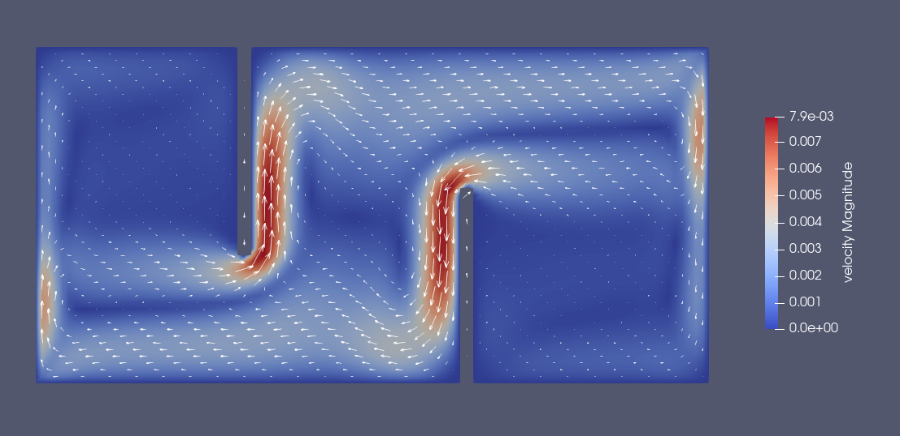

### a) Plane shear flow
**Velocity**

**Stream tracer**

**Glyph**

**Pressure**

### b) The Karman Vortex Street
**Velocity**

**Stream tracer**

**Glyph**

**Pressure**

### c) Flow over a Step
**Velocity**

**Stream tracer**

**Glyph**

**Pressure**

### d) Natural Convection
#### 1) nu = 0.001
**Velocity**

**Stream tracer**

**Glyph**

**Pressure**

#### 2) nu = 0.0002
**Velocity**

**Stream tracer**

**Glyph**

**Pressure**

### e) Fluid Trap 
**Velocity**

**Stream tracer**

**Glyph**

**Pressure**

### f) Rayleigh-Bernard Convection
**Velocity**

**Stream tracer**

**Glyph**

**Pressure**
