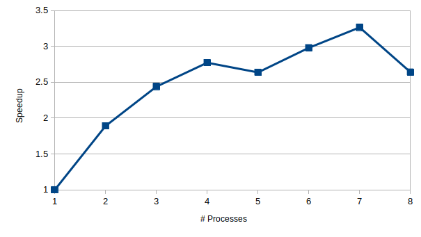
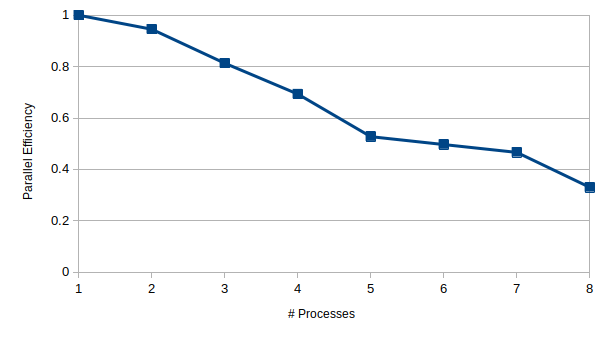
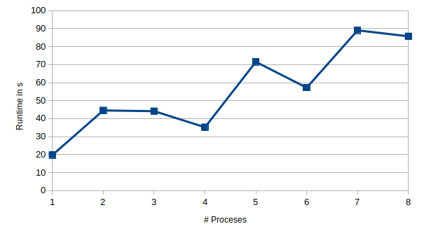

## Performance Analysis  

### Strong Scaling on RayleighBenardConvection with

* imax = 85  
* jmax = 18  
* t_end = 20000
* 1-8 processes, domain only split along x-axis

**Speedup:**  
  
**Parallel Efficiency**  
  

For 2 processes the speedup can be really close to the theoretical speedup. There are multiple reasons for why the speedup stays far below the theoretical speedup for more processes. With increasing number of processes we increase also the communication overhead and increase the fraction of sequential code. The efficiency drops for more than 5 processes since then --use-hwthread-cpus needed to be enabled. The big drop for 8 processes is mainly due to our  simple partitioning in which the last processor takes additionally the leftover cells. Hence the work is not properly distributed for when the number of cells is not dividable by the number of processes.

### Weak Scaling on LidDrivenCavity with 
|         |       |       |       |       |       |       |       |       |
| :------ | :---: | :---: | :---: | :---: | :---: | :---: | :---: | :---: |
| imax    |  50   |  100  |  150  |  100  |  250  |  150  |  350  |  200  |
| jmax    |  50   |  50   |  50   |  100  |  50   |  100  |  50   |  100  |
| xlength |   1   |   2   |   3   |   2   |   5   |   3   |   7   |   4   |
| ylength |   1   |   1   |   1   |   2   |   1   |   2   |   1   |   2   |

**Runtime:**  
  

For the weak scaling analysis we try to increase the domain with the number of processes to keep the workload per process approximately the same. Additionally to imax and jmax we adjusted xlength and ylength to avoid more timesteps due to smaller grid spacings.