# Worksheet 3 Results

1. [Validation of results](#1-validation-of-results)  
2. [Performance Analysis](#2-performance-analysis)  

## 1. Validation of results

### Lid Driven Cavity

Processes (iproc, jproc) | Velocity       |  Pressure
:-----------------------:|:--------------:|:------------:
sequential| 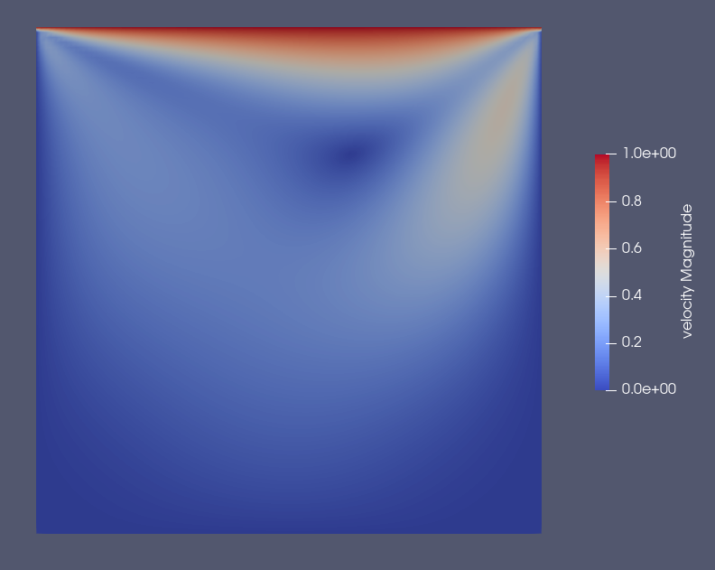 | 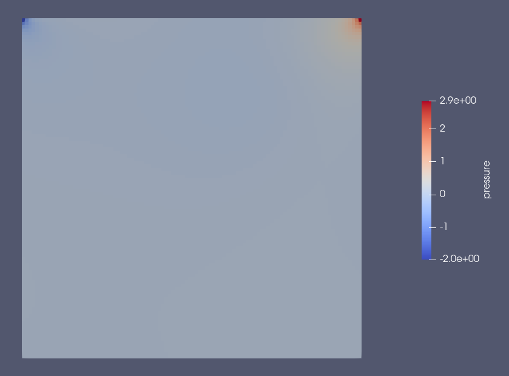
(1, 1) | 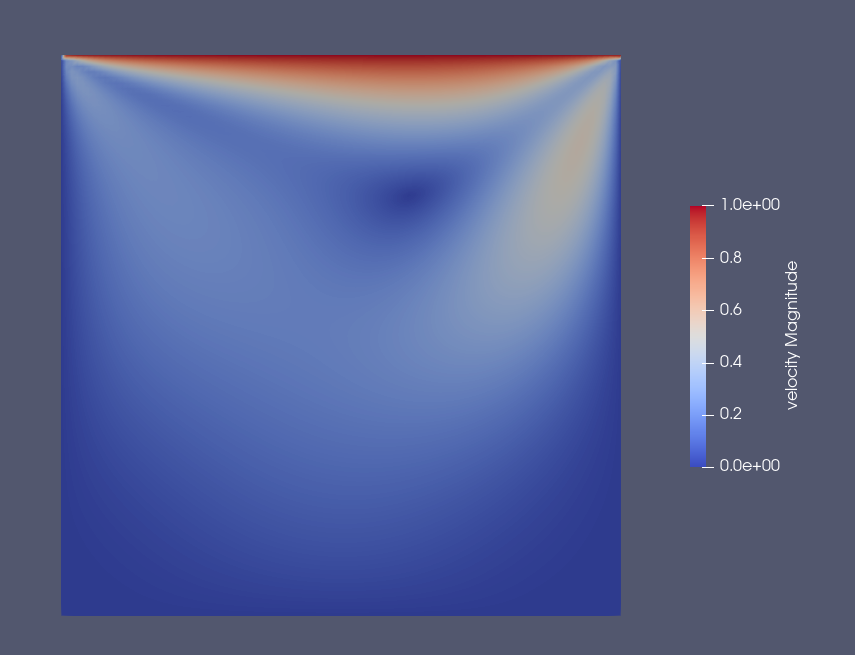 | 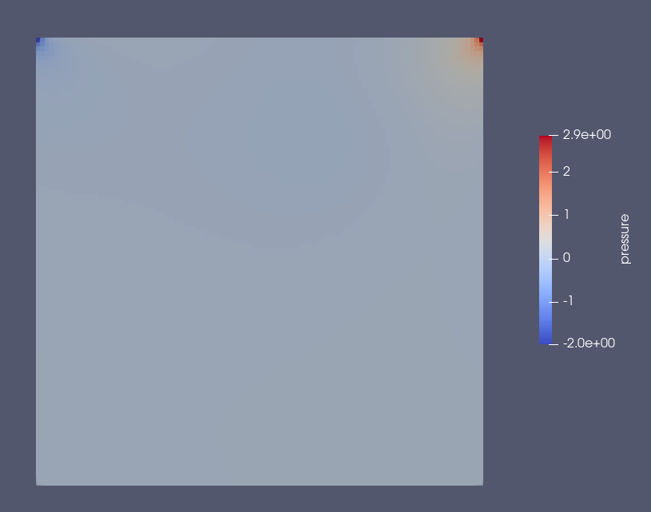
(2, 2) | 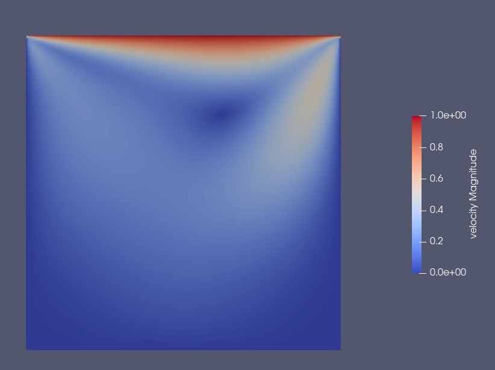 | 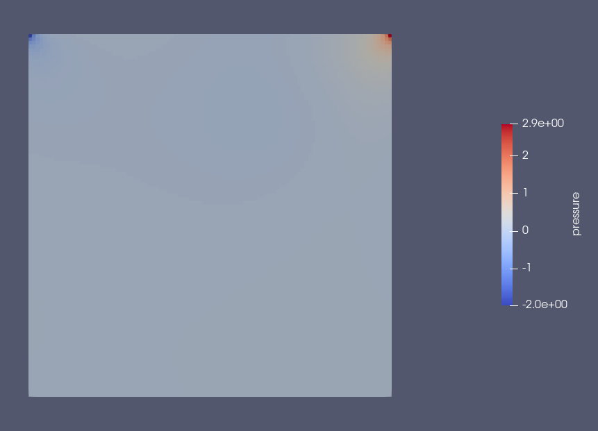
(1, 4) | 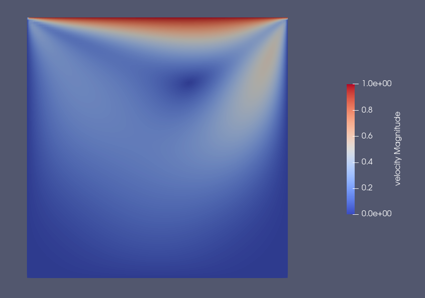 | 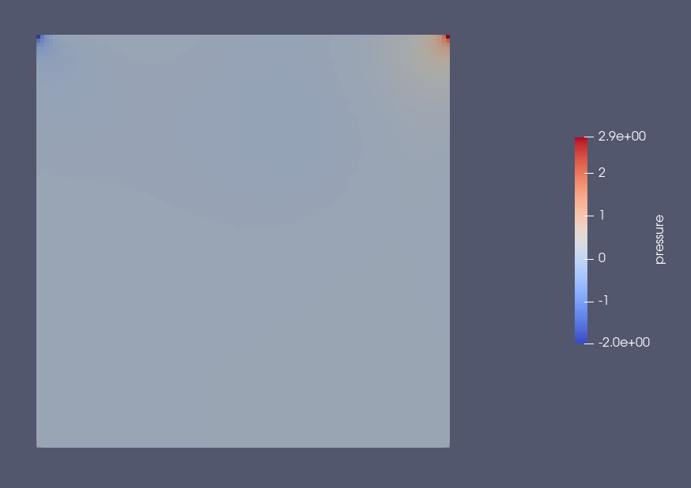
(3, 2) | 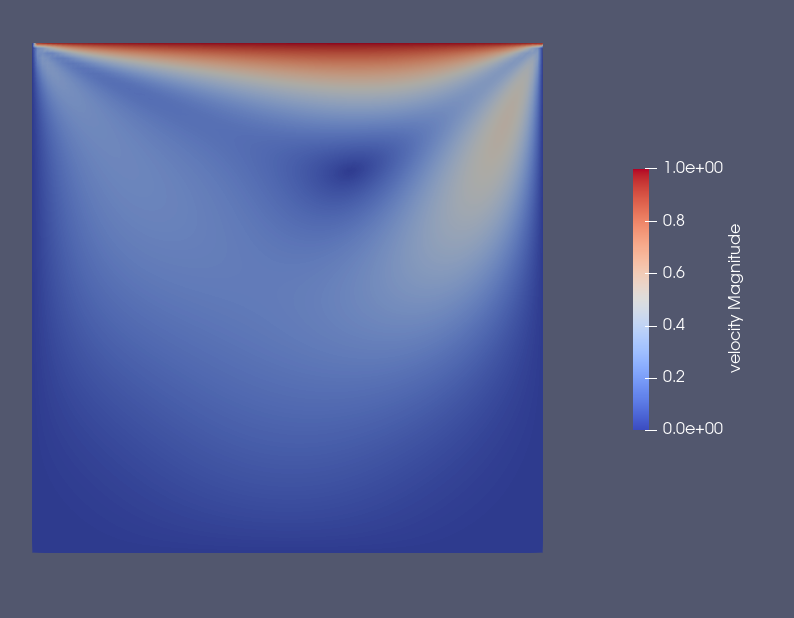 | 

The end results for velocity and pressure are the same for every case, indicating a correct parallel implementaion.

#### Convergence of Lid Driven Cavity

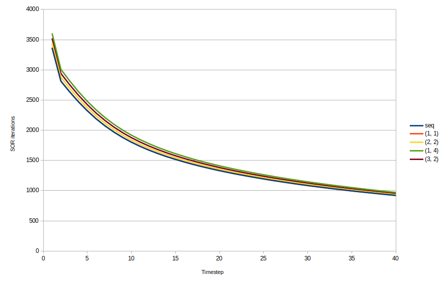

Above chart shows the number of SOR iteration that were needed to achieve a residual lower than the eps value for the first 40 timesteps. The effect of the mixed Jacobi/Gauss-Seidel relaxation can be seen by the slightly higher numbers for multiple processes. The (1,1)-MPI configuration line though is not visible, since it lies exactly beneath the sequential line, indicating that our MPI_implementation works perfectly sequential for a single core.

### Fluid Trap

 -       | (sequential) |     (1, 1)     |      (2, 3) |
:-------:|:------------:|:--------------:|:------------:
Velocity |  | 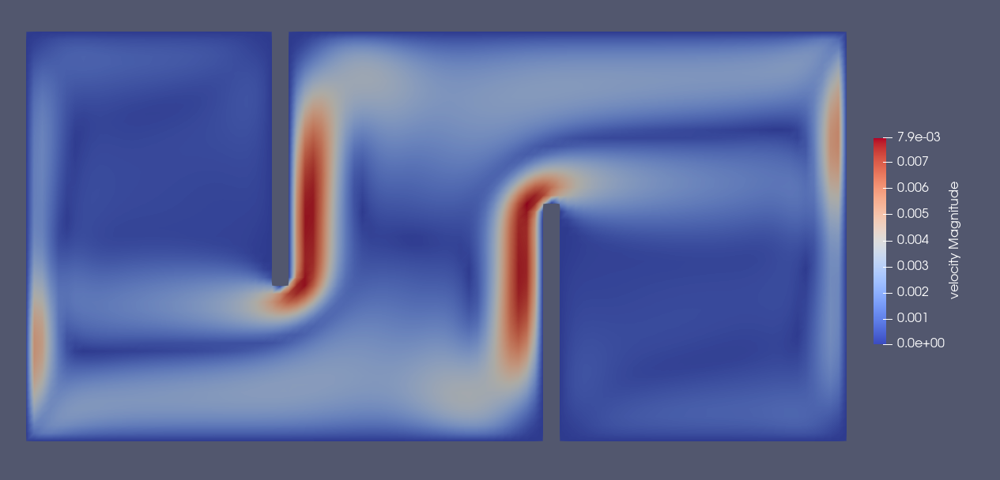 | 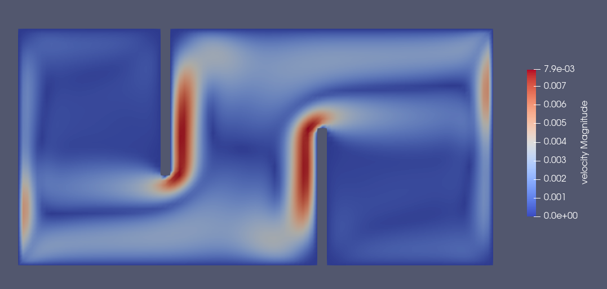
Pressure |  | 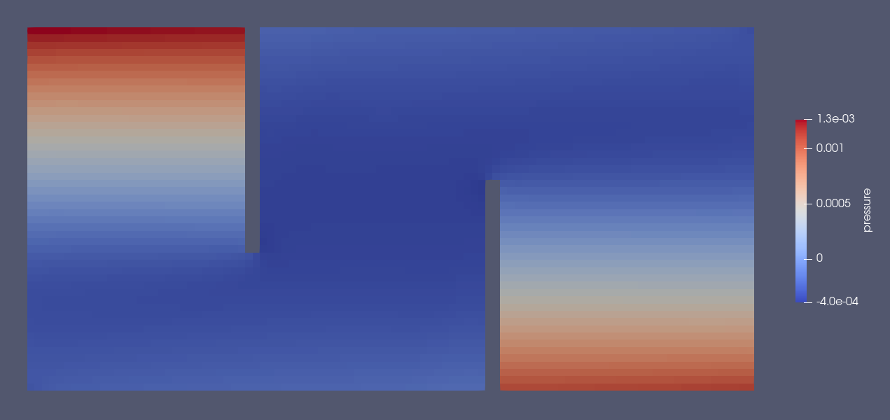 | 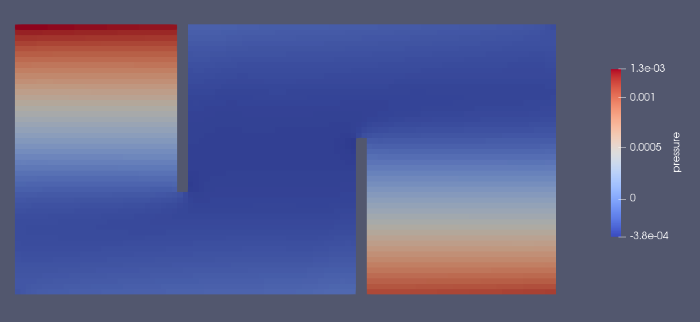
Temperature |  | 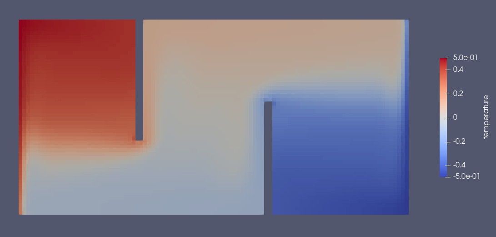 | 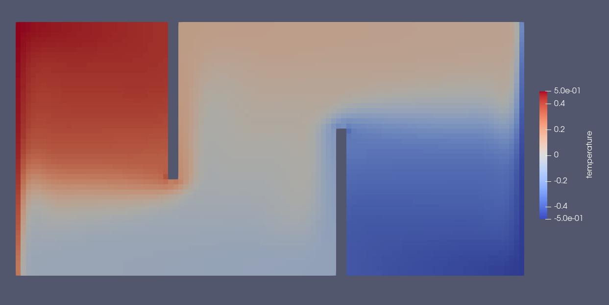

Again, the end results are exactly the same for all configurations.

## 2. Performance Analysis  

### Strong Scaling on RayleighBenardConvection with

* imax = 85  
* jmax = 18  
* t_end = 20000
* 1-8 processes, domain only split along x-axis
ppp
**Speedup:**  
  
**Parallel Efficiency**  
  

For 2 processes the speedup can be really close to the theoretical speedup. There are multiple reasons for why the speedup stays far below the theoretical speedup for more processes. With increasing number of processes we increase also the communication overhead and increase the fraction of sequential code. The efficiency drops for more than 5 processes since then --use-hwthread-cpus needed to be enabled. The big drop for 8 processes is mainly due to our  simple partitioning in which the last processor takes additionally the leftover cells. Hence the work is not properly distributed for when the number of cells is not dividable by the number of processes.

### Weak Scaling on LidDrivenCavity with

|         |       |       |       |       |       |       |       |       |
| :------ | :---: | :---: | :---: | :---: | :---: | :---: | :---: | :---: |
| imax    |  50   |  100  |  150  |  100  |  250  |  150  |  350  |  200  |
| jmax    |  50   |  50   |  50   |  100  |  50   |  100  |  50   |  100  |
| xlength |   1   |   2   |   3   |   2   |   5   |   3   |   7   |   4   |
| ylength |   1   |   1   |   1   |   2   |   1   |   2   |   1   |   2   |

**Runtime:**  
  

For the weak scaling analysis we try to increase the domain with the number of processes to keep the workload per process approximately the same. Additionally to imax and jmax we adjusted xlength and ylength to avoid more timesteps due to smaller grid spacings.  
The chart clearly shows the rising communication overhead for more processes. One should also keep in mind that we don't solve the exact problem for the several cases, therefore the weak scaling analysis might not be too accurate.
